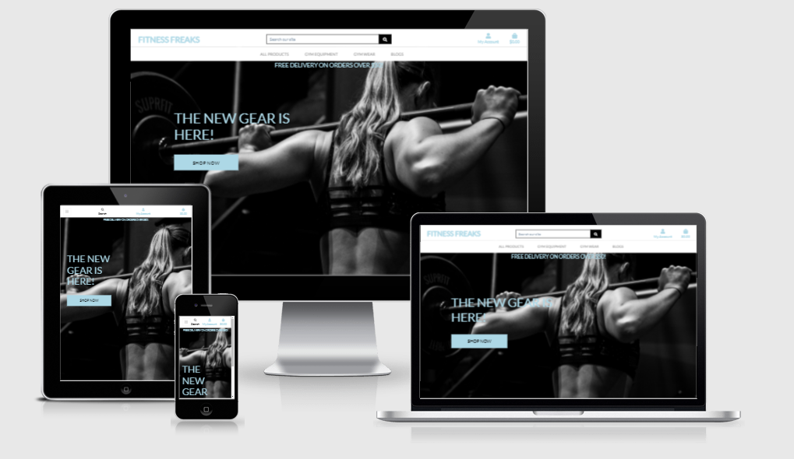

<h1 align="center">Fitness Freaks</h1>

[View the live project here.](https://fitness-freaks-website.herokuapp.com/)

The idea of this project was to create a site where fitness enthusiasts could come to buy fitness equipment or clothes.

The user can also find information of interest via the blogs.



## User Experience (UX)

-   ### User stories

    -   #### Gymwear ethusiast Goals 

        1. As a gymwear enthusiast, I want a site that sells luxury gymwear for me to purchase.
        2. As a gymwear enthusiast, I want a site that will provide me details and reviews of those products.

    -   #### Gym Equipment ethusiast Goals

        1. As a Gym Equipment enthusiast, I want a site that sells luxury gym equipment for me to purchase.
        2. As a Gym Equipment enthusiast, I want a site that will provide me details and reviews of those products.

    -   #### Fitness Novice Goals

        1. As a novice looking to get into fitness, I want a site where I can find advice on regimes or techniques.
        2. As a novice looking to get into fitness, I want to be able to request help and to interact with the fitness community.

-   ### Design
    -   #### Colour Scheme
        -   The Main themes are light blue and grey/black.
        -   The site has a minimalistic, clean design.

*   ### Wireframes

    -   Wireframes for all devices - [View](Documentation/Wireframes/FitnessFreaks.pdf)


## Features

-   Responsive on all device sizes.

-   Product Creation. Edit and Delete functionality are also present. This functionality is for the admin only.

-   Blog model created. Only the admin can create blog posts via the admin panel.

-   Comment creation. Anyone can leave a comment on any blog. The admin has to accept the comments to avoid any unwanted profanities.
 

## Technologies Used

### Languages Used

-   [HTML5](https://en.wikipedia.org/wiki/HTML5)
-   [CSS3](https://en.wikipedia.org/wiki/Cascading_Style_Sheets)
-   [Javascript](https://en.wikipedia.org/wiki/JavaScript)
-   [Python](https://en.wikipedia.org/wiki/Python_(programming_language))

### Frameworks, Libraries & Programs Used

1. [Bootstrap:](https://getbootstrap.com/)
    - Bootstrap was used to assist with the responsiveness and styling of the website.
1. [Stripe:](https://stripe.com/gb)
    - Stripe used for e-commerce functionality.
1. [Git](https://git-scm.com/)
    - Git was used for version control by utilizing the Gitpod terminal to commit to Git and Push to GitHub.
1. [GitHub:](https://github.com/)
    - GitHub is used to store the projects code after being pushed from Git.
1. [Balsamiq:](https://balsamiq.com/)
    - Balsamiq was used to create the [wireframes](Documentation/Wireframes/FitnessFreaks.pdf) during the design process.
1. [Jquery:](https://jquery.com/)
    - Jquery used for dynamic functionality.


## Testing

The W3C Markup Validator and W3C CSS Validator Services were used to validate every page of the project to ensure there were no syntax errors in the project.

-   [W3C Markup Validator](https://jigsaw.w3.org/css-validator/#validate_by_input) - [Results](Documentation/FFValidation.png) 1 error caused from collation of html files.
-   [W3C CSS Validator](https://jigsaw.w3.org/css-validator/#validate_by_input) - [Results](Documentation/CSSValidationFitnessFreaks.png)

### Testing User Stories from User Experience (UX) Section

-   #### Gymwear enthusiast Goals

    1. As a gymwear enthusiast, I want a site that sells luxury gymwear for me to purchase.

        1. Upon entering the site, users are directed towards all of the products. A gymwear enthusiast could navigate to their desired products via the navbar.
        2. The user could also navigate there using the search tool.
        3. They could filter all the products and sort them by the category they want.

    2. As a gymwear enthusiast, I want a site that will provide me details and reviews of those products.

        1. Each product has a detailed description and a rating that provides the user with a good understanding of the product quality.
        2. The user can even sort by rating or price to give themselves a good view of the most desirable items.

-   #### Gym Equipment enthusiast Goals

    1. As a Gym Equipment enthusiast, I want a site that sells luxury gym equipment for me to purchase.

        1. The site provides gym equipment enthusiasts with many different types of gym equipment. From cheap weights, to luxury bikes.
        2. The user can also check out the blogs where the admin can announce new top of the range equipment.

    2. As a Gym Equipment enthusiast, I want a site that will provide me details and reviews of those products.

        1. The user can sort all the equipment by the individual category as well as by rating and price.

-   #### Fitness Novice Goals

    1. As a novice looking to get into fitness, I want a site where I can find advice on regimes or techniques.

        1. A fitness novice can be tremendously helped by information provided on the blogs page.
        2. The information they find their could not only help with training regimes, but could also help them find the ideal beginner gear they might want to buy.

    2. As a novice looking to get into fitness, I want to be able to request help and to interact with the fitness community.

        1. The comment section allows the user to interact with every single blog post made.
        2. In the comment section they could ask questions about information found in the post. Or perhaps even suggest future blog ideas that would help them out.
        3. The comment section is also a great place for members to discuss their workouts, as well as recommend the products that they find to be most beneficial.

### Further Testing

1. Testing the site
    * Click on all navigation links including the Logo to ensure they are working correctly.
    * Repeat this while logged in and while logged out to ensure consistency.
    * Use the search bar extensively to verify functionality.
    * Search something that is not on the site to ensure No results shows up as expected.
    * Use the sort by function to verify functionality.
    * Sort by every variable to ensure they are working as intended.
    * Create a new account and verify email confirmation.
    * Use the blog post list to view each post detail to ensure they are correctly linked.
    * Use the admin panel to create new blogs and ensure they are displaying as intended.
    * Create comments to see if they are published automatically.
    * Accept the comments via the admin panel and see if they are on their respective blog posts.
    * While logged in as admin, test creation of new product functionality.
    * Furthermore, test the edit and delete functionality as superuser.
    * Log in to different users to verify functionality changes.
    * Enter invalid information during checkout to ensure forms cannot be completed.
    * Enter required information during checkout to verify functionality.
    * Check emails for order detail and confirmation.
    * Repeat all these steps across all device sizes.


-   The Website was tested on Google Chrome, Internet Explorer, Microsoft Edge and Safari browsers.
-   The website was tested on Laptop, Desktop, Ipad, GalaxyS5, OnePlus6.
-   Friends and family members were asked to review the site and documentation to point out any bugs and/or user experience issues.

### Known Bugs

-   On smaller phones, the blog comment entry field breaks from the card.

## Deployment

### Heroku

The project was deployed to Heroku using the following steps...

1. Create requirements.txt so Heroku knows which applications and dependencies are required.
2. Create Procfile with web: gunicorn fitness_freaks.wsgi:application
3. Create a new app on Heroku.
4. Enable automatic deployment from github repository.
5. Next, use config vars to enter all the env variables into Heroku.
6. Input AWS_ACCESS_KEY_ID, AWS_SECRET_ACCESS_KEY, DATABASE_URL, EMAIL_HOST_PASS, EMAIL_HOST_USER, SECRET_KEY, STRIPE_PUBLIC_KEY, STRIPE_SECRET_KEY, STRIPE_WH_SECRET, and USE_AWS values.
7. Commit requirememts.txt and Procfile.
8. Enable Automatic deployment on Heroku.
9. Deploy master branch.

### Forking the GitHub Repository

By forking the GitHub Repository we make a copy of the original repository on our GitHub account to view and/or make changes without affecting the original repository by using the following steps...

1. Log in to GitHub and locate the [GitHub Repository](https://github.com/sykez12/fitness_freaks)
2. At the top of the Repository (not top of page) just above the "Settings" Button on the menu, locate the "Fork" Button.
3. You should now have a copy of the original repository in your GitHub account.

### Making a Local Clone

1. Log in to GitHub and locate the [GitHub Repository](https://github.com/sykez12/fitness_freaks)
2. Under the repository name, click "Clone or download".
3. To clone the repository using HTTPS, under "Clone with HTTPS", copy the link.
4. Open Git Bash
5. Change the current working directory to the location where you want the cloned directory to be made.
6. Type `git clone`, and then paste the URL you copied in Step 3.

```
$ git clone https://github.com/sykez12/fitness_freaks
```

7. Press Enter. Your local clone will be created.

```
$ git clone https://github.com/sykez12/fitness_freaks
> Cloning into `CI-Clone`...
> remote: Counting objects: 10, done.
> remote: Compressing objects: 100% (8/8), done.
> remove: Total 10 (delta 1), reused 10 (delta 1)
> Unpacking objects: 100% (10/10), done.
```

Click [Here](https://help.github.com/en/github/creating-cloning-and-archiving-repositories/cloning-a-repository#cloning-a-repository-to-github-desktop) to retrieve pictures for some of the buttons and more detailed explanations of the above process.

## Credits

### Code


-   [Bootsstrap](https://getbootstrap.com/): Bootstrap used throughout the project mainly to make site responsive.


### Acknowledgements

-   My Mentor Aaron for his continuous, helpful input.

-   Code Institute tutorials were used extensively for this project.

-   Tutor support at Code Institute for their assistance.
